<div align="center">


<br/>

<a href="https://github.com/kRiShNa-429407">
  
</a>
<a href="mailto:kaushik4294cse@gmail.com">
  
</a>

</div>

---

## 🧠 About Me

```python
krishna = {
    "name": "Krishna Kaushik",
    "role": "AI / Machine Learning Enthusiast",
    "languages": ["Python"],
    "interests": [
        "Artificial Intelligence",
        "Machine Learning",
        "Deep Learning",
        "Data Science"
    ],
    "currently_learning": [
        "PyTorch",
        "Transformers",
        "RAG",
        "LLMs"
    ],
    "goal": "Build practical AI systems that solve real-world problems"
}
```

- 🔭 Exploring **Artificial Intelligence, Machine Learning and Deep Learning**
- 🧠 Currently learning **PyTorch, Transformers, RAG and LLM concepts**
- 📊 Interested in turning raw data into meaningful and useful solutions
- 💬 Ask me about **Python, Machine Learning, Deep Learning and Data Science**
- 📝 I share technical learning and ideas on **[Medium](https://medium.com/@kk429407)**
- 📫 Reach me at **kaushik4294cse@gmail.com**

---

## ⚙️ My AI / ML Toolbox

<div align="center">

### Core


<br/><br/>

### Data & Machine Learning


<br/><br/>

### Currently Exploring


</div>

---

## 🚀 What I'm Focused On

<table>
<tr>
<td width="50%" valign="top">

### 🤖 Artificial Intelligence
Learning how intelligent systems understand, reason and generate useful outputs.

### 🧠 Deep Learning
Understanding neural networks, backpropagation, optimization and model training.

</td>
<td width="50%" valign="top">

### 📚 RAG & LLMs
Exploring retrieval pipelines, embeddings, vector databases and large language models.

### 📊 Data Science
Working with data preprocessing, analysis, visualization and machine learning workflows.

</td>
</tr>
</table>

---

## 🏅 GitHub Highlights

<div align="center">

<a href="https://github.com/kRiShNa-429407">
  
</a>


</div>

---

## 🏆 GitHub Trophies

<div align="center">

<!-- Generated by .github/workflows/profile-cards.yml -->


</div>

---

## 📈 GitHub Analytics

<div align="center">

<!-- Generated locally in this repository by GitHub Actions -->



</div>

---

## 🔥 GitHub Streak

<div align="center">


</div>

---

## ⚡ Contribution Activity

<div align="center">


</div>

---

## 🌐 Connect With Me

<div align="center">

<a href="https://www.linkedin.com/in/krishna-kaushik-ml/">
  
</a>
<a href="https://www.kaggle.com/krishnaaiml">
  
</a>
<a href="https://medium.com/@kk429407">
  
</a>
<a href="mailto:kaushik4294cse@gmail.com">
  
</a>

</div>

---

<div align="center">

### 💡 "Learn. Build. Experiment. Improve."

<br/>


</div>
